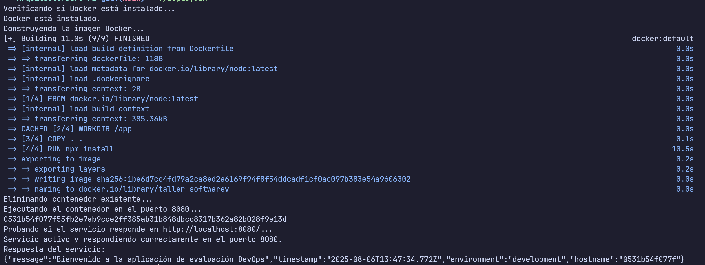
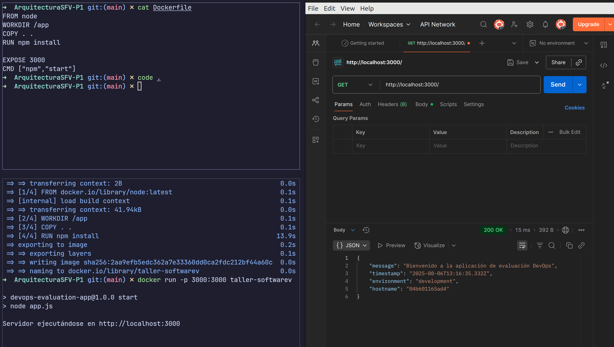

# ArquitecturaSFV-P1

# Evaluación Práctica - Ingeniería de Software V

## Información del Estudiante
- **Nombre: Gabriel Escobar**
- **Código: A00399291**
- **Fecha: 08/06/2025**

## Resumen de la Solución

Se implementó una solución contenerizada para una aplicación Node.js usando Docker. Esto permite ejecutar la app de forma consistente en cualquier entorno sin requerir instalaciones adicionales. La solución facilita la portabilidad, automatiza el entorno y deja lista la app para integrarse con pipelines de CI/CD.

## Dockerfile

A continuación, se muestra el contenido del `Dockerfile` usado para construir la imagen de la aplicación:

```dockerfile
FROM node
WORKDIR /app
COPY . .
RUN npm install

EXPOSE 3000
CMD ["npm", "start"]
```

FROM node: Utiliza la imagen oficial de Node.js para garantizar compatibilidad.

WORKDIR /app: Define un entorno de trabajo dentro del contenedor.

COPY . .: Copia todo el código fuente del proyecto al contenedor.

RUN npm install: Instala las dependencias necesarias.

EXPOSE 3000: Indica el puerto usado por la app (útil para el mapeo).

CMD ["npm", "start"]: Define el comando que se ejecutará al iniciar el contenedor.

## Script de Automatización
```

#!/bin/bash

# Nombre de la imagen y contenedor
IMAGE_NAME="taller-softwarev"
CONTAINER_NAME="taller-softwarev-container"
PORT=8080

echo "Verificando si Docker está instalado..."

if ! command -v docker &> /dev/null; then
  echo "Docker no está instalado. Instálalo antes de continuar."
  exit 1
fi

echo "Docker está instalado."

# Construir la imagen
echo "Construyendo la imagen Docker..."
docker build -t $IMAGE_NAME .

if [ $? -ne 0 ]; then
  echo "Error al construir la imagen."
  exit 1
fi

# Eliminar contenedor anterior si existe
if docker ps -a --format '{{.Names}}' | grep -Eq "^${CONTAINER_NAME}\$"; then
  echo "Eliminando contenedor existente..."
  docker rm -f $CONTAINER_NAME > /dev/null
fi

# Ejecutar el contenedor
echo "Ejecutando el contenedor en el puerto $PORT..."
docker run -d --name $CONTAINER_NAME -p $PORT:3000 \
  $IMAGE_NAME

sleep 3

# Probar si el servicio responde
echo "Probando si el servicio responde en http://localhost:$PORT/..."

RESPONSE=$(curl --fail --silent http://localhost:$PORT/)
if [ $? -eq 0 ]; then
  echo "Servicio activo y respondiendo correctamente en el puerto $PORT."
  echo "Respuesta del servicio:"
  echo "$RESPONSE"
  exit 0
else
  echo "El servicio no respondió. Verifica los logs del contenedor:"
  docker logs $CONTAINER_NAME
  exit 1
fi


```


## Principios DevOps Aplicados
###  1. Collaboration
El uso de contenedores facilita la colaboración entre desarrolladores, testers y operaciones, ya que todos trabajan con el mismo entorno aislado y replicable.

###  2. Automation
La construcción y ejecución de la app está completamente automatizada mediante Docker, eliminando tareas manuales y reduciendo errores de configuración.

###  3. Continuous Improvement
El uso de contenedores permite iterar rápidamente sobre la aplicación, probando nuevas versiones sin afectar el entorno de producción, promoviendo así la mejora continua.
## Captura de Pantalla


## Mejoras Futuras
1. **Uso de Docker Compose**
   Implementar Docker Compose permitiría orquestar de forma más sencilla múltiples servicios (por ejemplo, una base de datos junto con la app), facilitando el manejo de variables de entorno, puertos y volúmenes desde un solo archivo `docker-compose.yml`.

2. **Integración Continua (CI)**
   Automatizar la construcción, prueba y despliegue de la imagen Docker utilizando herramientas como GitHub Actions, GitLab CI o Jenkins. Esto aseguraría que cada cambio pase por un flujo de validación antes de llegar a producción.

3. **Testing Automatizado**
   Incluir pruebas automatizadas con frameworks como Jest o Mocha para validar que la API responde correctamente antes de construir la imagen. Esto mejora la confiabilidad del software.

## Instrucciones para Ejecutar
```
# Construir la imagen
docker build -t taller-softwarev .

# Ejecutar el contenedor
docker run -p 3000:3000 taller-softwarev

```
